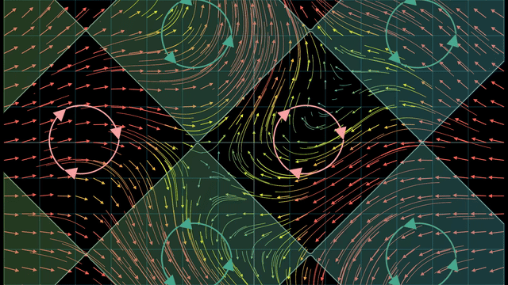
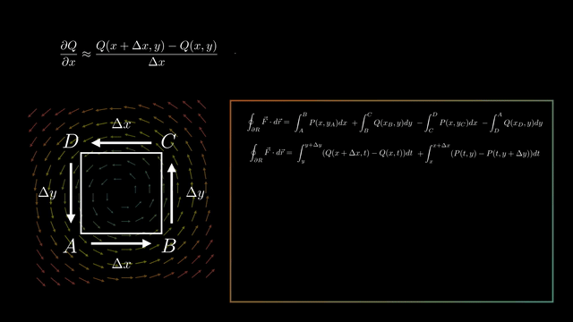
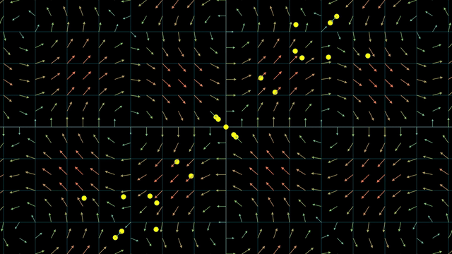

# Manim Mathematics Portfolio

Welcome to my programmatic animation portfolio. I am a Mathematics for Engineering undergraduate and a self-taught Manim developer. This repository contains the source code for my mathematical animations, focusing on clear visual storytelling, object-oriented architecture, and rigorous analytical accuracy.

Currently, I develop programmatic visualizations for the Math Outreach Team at Politecnico di Torino (*KerPolito*, 7k+ followers), translating complex university-level topics into accessible digital content.

---

## 📂 Selected Projects

### 1. Vector Calculus: Green's & Stokes' Theorems (KerPolito Outreach)
* **Status:** Work in Progress
* **Code:** [`/green_stokes`](./green_stokes)

**Mathematical Focus:** A step-by-step visual breakdown of multivariable calculus theorems. 

### 2. Fourier Series Analytical Visualization
* **Status:** Completed
* **Code:** [`/fourier_series`](./fourier_series)
* **Final Video** [Final Video on Youtube (in italian)](https://youtu.be/p988GhnbYUo)

**Mathematical Focus:** A deep dive into the mechanics of Fourier Series, breaking down complex waveforms into rotating epicycles.

### 3. Integration Bee Visualizations
* **Status:** Work in Progress
* **Code:** [`/integration_bee`](./integration_bee)

**Mathematical Focus:** Dynamic visualizations of complex integrals and problem-solving strategies.

---

## 🛠 Technical Stack & Workflow
* **Framework:** Manim (Community Edition)
* **Language:** Python 3.x
* **Typography:** LaTeX
* **Architecture:** Object-Oriented Design, Custom `Mobject` creation, dynamic `ValueTracker` implementations.

## 🚀 Local Setup
To run the scripts in this repository locally, ensure you have Manim installed and your environment configured.

1. Clone the repository: `git clone https://github.com/[Your-Username]/[Repo-Name].git`
2. Navigate to the desired project folder (e.g., `cd fourier_series`)
3. Run the scene: `manim -pql main_scene.py [SceneName]`
